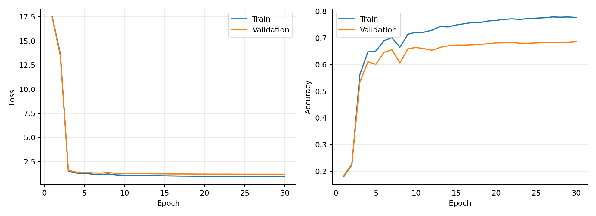
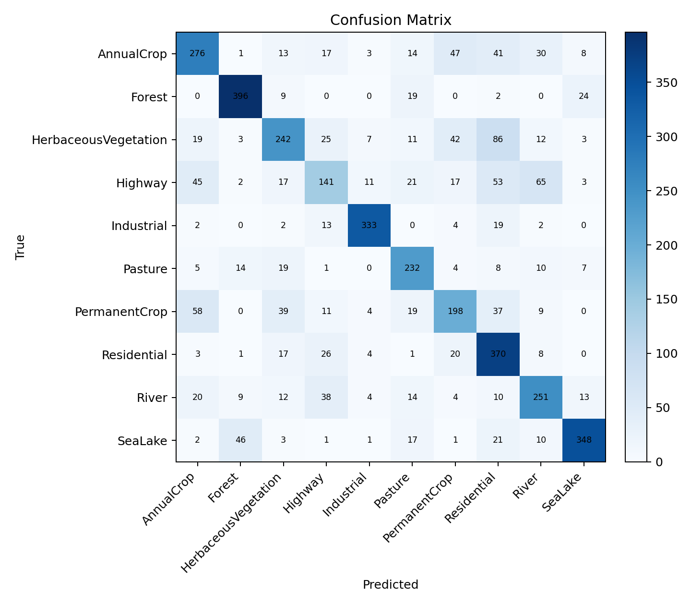
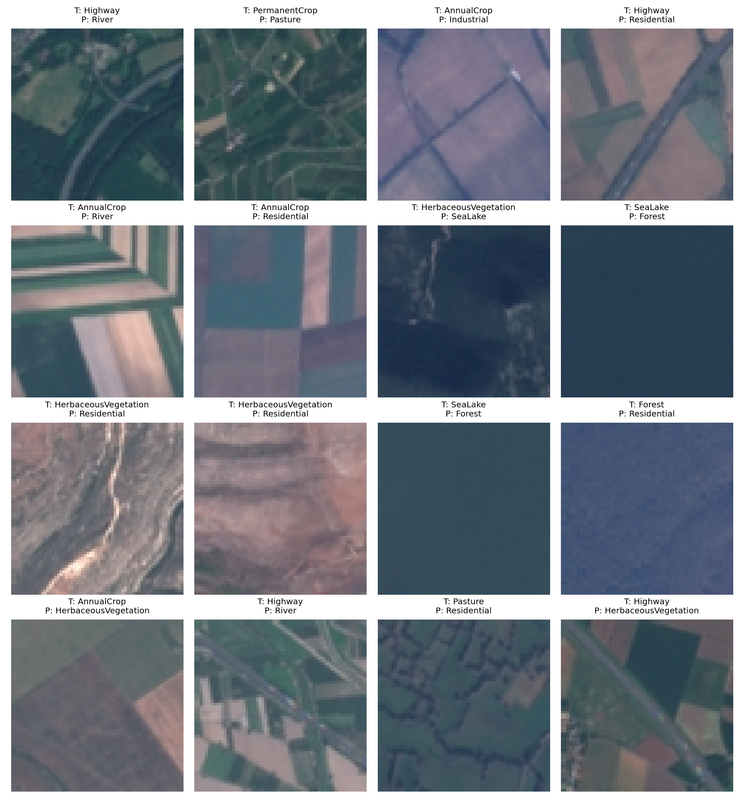

# HW1 EuroSAT RGB MLP Report

## Experimental Setup

- Model: one-hidden-layer MLP, hidden dimension = 512, activation = relu.
- Input: RGB images resized from 64x64 to 16x16, flattened and standardized by the training split.
- Split: stratified 70%/15%/15% train/validation/test.
- Optimizer: mini-batch SGD, initial learning rate = 0.16, decay = 0.9 per epoch.
- Loss: cross-entropy with L2 weight decay = 0.0005.
- Array backend: numpy.
- Best validation epoch: 30.

## Results

- Test loss: 1.1440
- Test accuracy: 0.6881

## Error Analysis

The weakest classes by per-class test accuracy are Highway (0.376), PermanentCrop (0.528), HerbaceousVegetation (0.538). These errors are plausible because several EuroSAT categories share visual texture and color cues at low resolution. For example, PermanentCrop, AnnualCrop, and HerbaceousVegetation can all contain repetitive green field patterns, while River and Highway may both appear as long narrow structures crossing mixed backgrounds.

Representative mistakes are shown below when the model produces any test errors.

